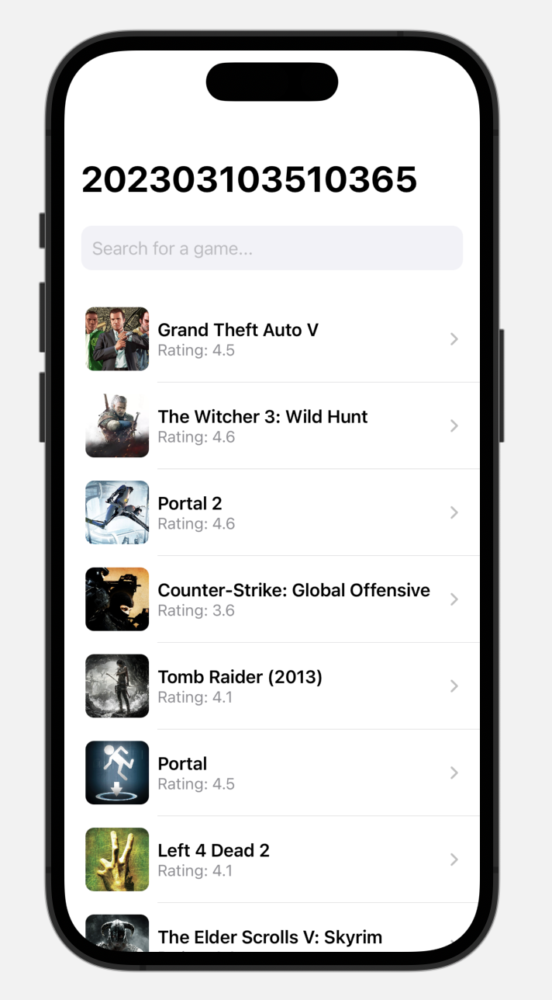
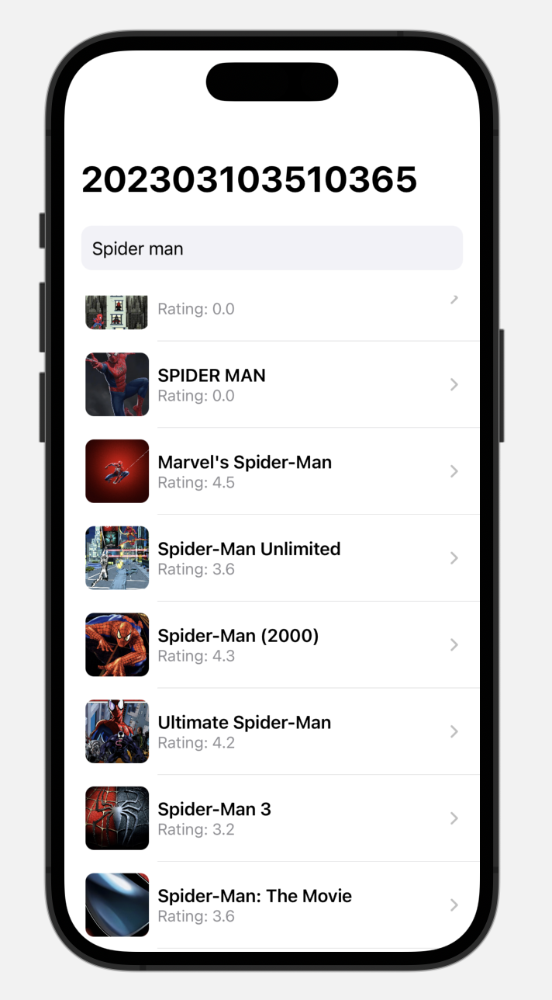
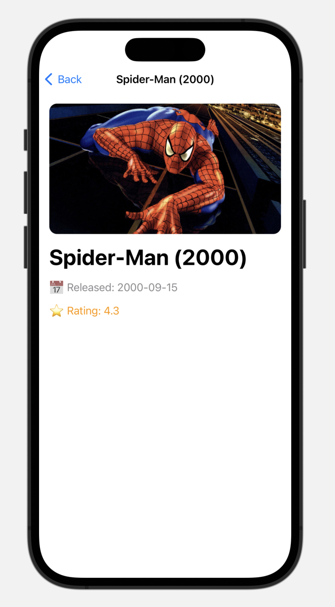

#  GameInfoExplorer

GameInfoExplorer is an iOS application developed using **SwiftUI** that allows users to search for games, view ratings, and read basic descriptions using real-time API data.

---

## Features

-  Search games by name  
-  View game ratings  
-  Read basic game descriptions  
-  Fetch real-time data using API  
-  Clean and responsive UI with SwiftUI  

---

##  Tech Stack

- Swift  
- SwiftUI  
- Xcode  
- REST API  
- JSON Parsing  

---

##  Concepts Used

- API Integration  
- Asynchronous Data Fetching  
- MVVM-like Structure  
- State Management in SwiftUI  

---

## 📸 SS (Screenshots)

###  Home Screen


###  Search Screen


###  Detail Screen


---

## ⚙️ Setup Instructions

1. Clone the repository:
   ```bash
   git clone https://github.com/YOUR_USERNAME/GameInfoExplorer.git
